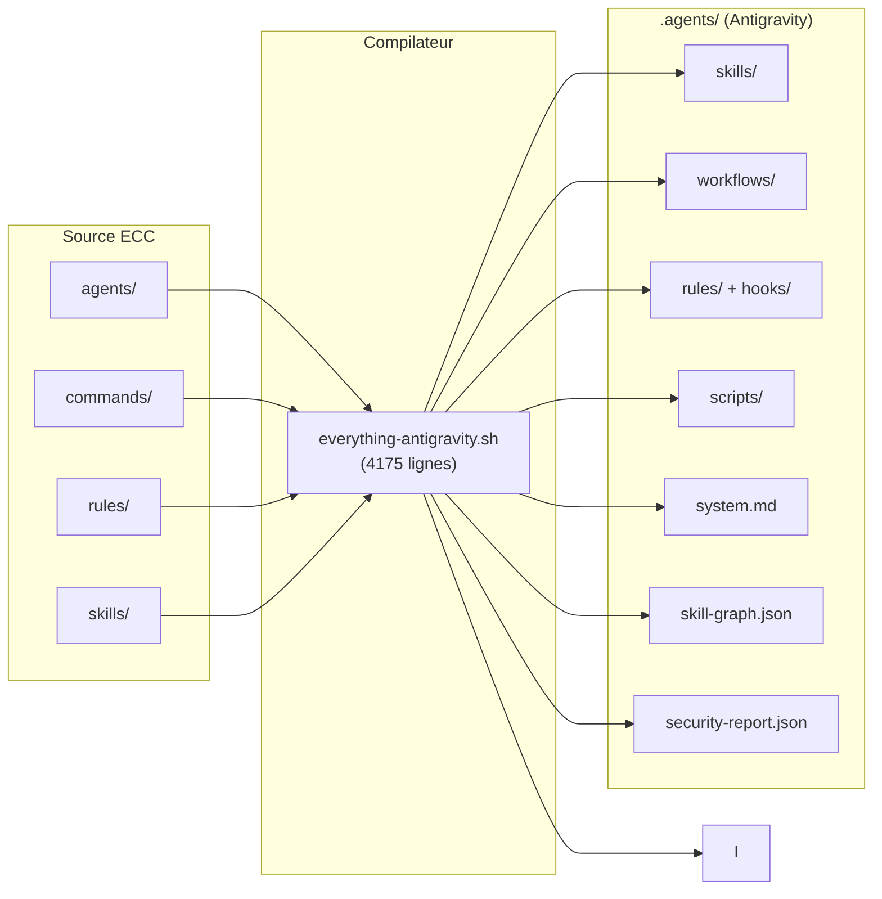

# ECC → Antigravity — Guide de mise en œuvre

> Compilateur agentique qui transforme la bibliothèque [Everything Claude Code](https://github.com/anthropics/everything-claude-code) en un environnement de développement autonome pour l'IDE Google Antigravity.

---

## Table des matières

1. [Vue d'ensemble](#vue-densemble)
2. [Prérequis](#prérequis)
3. [Installation rapide](#installation-rapide)
4. [Utilisation détaillée](#utilisation-détaillée)
5. [Architecture générée](#architecture-générée)
6. [Les 7 étapes agentiques](#les-7-modules-agentiques)
7. [Outils de maintenance](#outils-de-maintenance)
8. [Mise à jour incrémentale](#mise-à-jour-incrémentale)
9. [Détection de projet](#détection-de-projet)
10. [Sécurité (AgentShield)](#sécurité-agentshield)
11. [Dépannage](#dépannage)
12. [Référence des flags](#référence-des-flags)

---

## Vue d'ensemble

Le script `everything-antigravity.sh` est un **compilateur agentique** qui :

```
ECC (233 fichiers source)  →  .agents/ (environnement Antigravity opérationnel)
```

Il ne se contente pas de copier des fichiers — il **analyse**, **transforme** et **enrichit** :

| Étape | Ce qui se passe |
|---|---|
| **Mapping** | Transpose agents → skills, commands → workflows, rules → rules (aplati) |
| **Configuration** | Génère la configuration de chaque skill (descriptions, catégories) |
| **Optimisation** | Compresse les prompts système, score la qualité, segmente |
| **Sécurité** | Scanne les secrets, audite les permissions, note la posture (grade A→F) |
| **Intelligence** | Génère hooks, graphe de dépendances, identité agent |
| **Outillage** | Déploie 5 scripts de maintenance + capacité de mise à jour |

---

## Prérequis

### Système

| Outil | Version min. | Vérification |
|---|---|---|
| `bash` | 4.0+ | `bash --version` |
| `python3` | 3.6+ | `python3 --version` |
| `git` | 2.0+ (optionnel, pour la détection du SHA source) | `git --version` |

### Fichiers source

```bash
# Cloner la bibliothèque EA
git clone https://github.com/anthropics/everything-claude-code.git

# Vérifier la structure attendue
ls everything-claude-code/
# agents/  commands/  rules/  skills/  docs/  ...
```

> **Important** : Le répertoire ECC doit contenir au minimum `agents/`, `commands/`, `rules/` et `skills/`.

---

## Installation rapide

### Étape 1 — Préparer l'environnement

```bash
# Se placer dans le répertoire de travail
cd /chemin/vers/votre/projet

# S'assurer que le script est exécutable
chmod +x everything-antigravity.sh
```

### Étape 2 — Lancer l'installation complète

```bash
bash everything-antigravity.sh ./everything-claude-code
```

### Étape 3 — Vérifier le résultat

```bash
# Structure générée
ls -la .agents/

# Dashboard de santé
.agents/scripts/ea-doctor
```

### Résultat attendu

```
==================================
✅ ECC → Antigravity conversion complete
==================================

  .agents/
  ├── system.md           (agent identity)
  ├── skills/             (49 agents + 182 skills)
  ├── workflows/          (68 commands)
  ├── rules/              (85 rules, flattened)
  │   └── hooks/          (7 lifecycle hooks)
  ├── scripts/            (5 runtime tools)
  ├── skill-graph.json    (dependency graph)
  ├── security-report.json
  └── ea-install-state.json
```

---

## Utilisation détaillée

### Mode par défaut (full install)

```bash
bash everything-antigravity.sh <chemin-ecc>
```

Effectue une installation complète et idempotente :
- Si une installation précédente existe, elle est nettoyée avant (seuls les fichiers tracés dans `ea-install-state.json` sont supprimés)
- Tous les objectifs et steps sont exécutés séquentiellement


### Mode verbeux

```bash
bash everything-antigravity.sh ./everything-claude-code --verbose
```

Affiche chaque fichier copié, chaque décision de mapping, et les détails de scoring.

### Mode optimisation

```bash
bash everything-antigravity.sh ./everything-claude-code --optimize
```

Active le pass d'optimisation des prompts :
- Compression des instructions système
- Scoring qualité sur 10 critères
- Segmentation intelligente du `system.md`
- Rapport de budget token

### Combinaison de flags

```bash
# Installation complète, optimisée, avec détection de stack
bash everything-antigravity.sh ./everything-claude-code --optimize --project . --verbose
```

---

## Architecture générée

```
.agents/
├── system.md                    # Identité agent + catalogue de skills
├── skills/                      # 234 skills au total
│   ├── <agent-slug>/            # Ex: code-reviewer/
│   │   └── SKILL.md             # Définition de l'agent (généré depuis agent.md)
│   ├── <ea-skill-slug>/         # Ex: python-patterns/
│   │   └── SKILL.md             # Instructions du skill
├── workflows/                   # 68 workflows (slash commands)
│   ├── plan.md
│   ├── code-review.md
│   └── ...
├── rules/                       # 85 règles (aplatissement hiérarchique, sans zh*)
│   ├── coding-standards.md
│   ├── hooks/                   # 7 hooks comportementaux
│   │   ├── bash-safety.md
│   │   ├── gateguard.md
│   │   ├── quality-gate.md
│   │   ├── config-protection.md
│   │   ├── design-quality.md
│   │   ├── session-context.md
│   │   └── strategic-compaction.md
│   └── ...
├── scripts/                     # 5 outils de maintenance
│   ├── ea-doctor               # Diagnostic de santé
│   ├── ea-list                 # Liste des composants installés
│   ├── ea-status               # Dashboard d'installation
│   ├── ea-logger               # Logger d'activité agent
│   └── ea-uninstall            # Désinstallation propre
├── logs/                        # Traces d'activité (ea-logger)
├── skill-graph.json             # Graphe de dépendances (234 nœuds, 492 arêtes)
├── logging-config.json          # Configuration du logging agent
├── security-report.json         # Rapport de sécurité AgentShield
└── ea-install-state.json       # État d'installation (SHA, compteurs, fichiers)
```

### Mapping source → destination

| Source ECC | Destination `.agents/` | Transformation |
|---|---|---|
| `agents/*.md` | `skills/<slug>/SKILL.md` | Conversion + nettoyage |
| `commands/*.md` | `workflows/<name>.md` | Copie directe |
| `rules/**/*.md` | `rules/<flat-name>.md` | Aplatissement (sans zh*) |
| `skills/*/SKILL.md` | `skills/<slug>/SKILL.md` | Copie directe |

---

## Les 7 étapes agentiques

Le compilateur implémente 7 étapes ("Steps") qui transforment une collection de fichiers statiques en un système agentique cohérent :

### Step 1 — Hooks / Lifecycle (`rules/hooks/`)

Transpose les hooks JavaScript d'ECC en **règles comportementales** que l'agent consulte nativement.

| Hook | Fichier | Impact |
|---|---|---|
| `bash-safety` | `bash-safety.md` | Bloque 8 patterns destructifs |
| `gateguard` | `gateguard.md` | +2.25 points qualité (mesuré) |
| `quality-gate` | `quality-gate.md` | 5 vérifications post-edit |
| `config-protection` | `config-protection.md` | 10 fichiers protégés |
| `design-quality` | `design-quality.md` | Anti-patterns UI |
| `session-context` | `session-context.md` | Chargement de contexte auto |
| `strategic-compaction` | `strategic-compaction.md` | Compaction logique |

### Step 2 — Graphe de dépendances (`skill-graph.json`)

Analyse automatique des relations inter-skills :

```json
{
  "_meta": {
    "total_skills": 234,
    "total_edges": 492,
    "with_dependencies": 54,
    "isolated": 77
  }
}
```

Types de relations détectées :
- **`depends_on`** : le skill A nécessite le skill B
- **`enhances`** : le skill A améliore le skill B
- **`related_to`** : association thématique

### Step 3 — Identité agent (`system.md`)

Prompt système dynamique qui agrège :
- Identité et rôle de l'agent
- Catalogue catégorisé des 234 skills
- Posture de sécurité (grade AgentShield)
- Règles et hooks actifs

### Step 4 — Détection de projet (`--project`)

Analyse automatique de la stack technique ; les technologies détectées sont enregistrées dans `system.md` à titre informatif :

```bash
# Détecte la stack et l'enregistre dans system.md
bash everything-antigravity.sh ./everything-claude-code --project /chemin/vers/mon/app
```

15+ indicateurs détectés : Python, Node.js, TypeScript, Go, Rust, Java, Kotlin, Swift, PHP, Ruby, C++, Flutter, Docker, Terraform, K8s.

### Step 5 — Outils runtime (`scripts/`)

5 scripts bash autonomes pour la maintenance quotidienne (voir [section dédiée](#outils-de-maintenance)).

### Step 6 — Mise à jour

Le full install est idempotent : une réinstallation nettoie et régénère automatiquement l'ensemble des fichiers tracés dans `ea-install-state.json`.

---

## Outils de maintenance

Les 5 scripts générés dans `.agents/scripts/` sont autonomes et ne dépendent que de `bash` et `python3`.

### `ea-doctor` — Diagnostic de santé

```bash
.agents/scripts/ea-doctor
```

Vérifie :
- ✅ Structure des répertoires (`skills/`, `workflows/`, `rules/`)
- ✅ Présence de `system.md`, `skill-graph.json`, `security-report.json`
- ✅ Intégrité de `ea-install-state.json`
- ✅ Cohérence des compteurs vs fichiers réels
- ⚠️ Signale les fichiers orphelins ou manquants

### `ea-list` — Inventaire des composants

```bash
.agents/scripts/ea-list              # Liste tout
.agents/scripts/ea-list skills       # Seulement les skills
.agents/scripts/ea-list workflows    # Seulement les workflows
.agents/scripts/ea-list rules        # Seulement les rules
.agents/scripts/ea-list hooks        # Seulement les hooks
```

### `ea-status` — Dashboard d'installation

```bash
.agents/scripts/ea-status
```

Affiche :
- Version de l'installeur
- Date d'installation
- Compteurs détaillés (agents, skills, workflows, rules)
- SHA du commit source (si disponible)

### `ea-logger` — Traçabilité de l'activité agent

```bash
.agents/scripts/ea-logger tail            # Flux en temps réel
.agents/scripts/ea-logger view 50         # 50 dernières entrées
.agents/scripts/ea-logger stats           # Statistiques du jour
.agents/scripts/ea-logger level [level]   # Voir ou changer le niveau (silent/info/debug)
.agents/scripts/ea-logger clear           # Archiver et vider
```

### `ea-uninstall` — Désinstallation propre

```bash
.agents/scripts/ea-uninstall
```

Supprime uniquement les fichiers tracés dans `ea-install-state.json`, laissant la structure `.agents/` intacte si d'autres outils l'utilisent.

---


## Détection de projet

Le flag `--project <chemin>` analyse votre codebase et **installe le dossier `.agents/` directement dans le projet cible** (comportement automatique depuis la v1.1.0).

### Utilisation

```bash
# Installe .agents/ dans ./ai-press-review/ ET détecte la stack Symfony
bash everything-antigravity.sh ./everything-claude-code --project ./ai-press-review

# Équivalent explicite avec --output
bash everything-antigravity.sh ./everything-claude-code \
  --project ./ai-press-review \
  --output ./ai-press-review/.agent

# Forcer une destination personnalisée (override du comportement automatique)
bash everything-antigravity.sh ./everything-claude-code \
  --project ./mon-app \
  --output /opt/agent-config
```

> **Règle de résolution du répertoire de sortie** :
> 1. `--output <path>` → priorité absolue, destination exacte
> 2. `--project <path>` seul → destination = `<path>/.agents/`
> 3. Ni l'un ni l'autre → destination = `.agents/` (répertoire courant)

### Indicateurs détectés

| Stack | Fichiers surveillés |
|---|---|
| Python | `pyproject.toml`, `requirements.txt`, `Pipfile`, `*.py` |
| Node.js | `package.json`, `node_modules/` |
| TypeScript | `tsconfig.json`, `*.ts` |
| Go | `go.mod`, `go.sum` |
| Rust | `Cargo.toml` |
| Java | `pom.xml`, `build.gradle` |
| Kotlin | `*.kt`, `build.gradle.kts` |
| Swift | `Package.swift`, `*.xcodeproj` |
| PHP/Laravel | `composer.json`, `artisan` |
| Ruby | `Gemfile` |
| C++ | `CMakeLists.txt`, `Makefile` |
| Flutter/Dart | `pubspec.yaml` |
| Docker | `Dockerfile`, `docker-compose.yml` |
| Terraform | `*.tf` |
| Kubernetes | `k8s/`, `helmfile.yaml` |

### Résultat

La stack détectée est enregistrée dans `system.md` à titre informatif (aucun skill n'est désactivé).

---

## Sécurité (AgentShield)

Le scanner de sécurité intégré analyse automatiquement tous les fichiers générés.

### Ce qui est scanné

| Catégorie | Patterns détectés |
|---|---|
| **Secrets** | API keys, tokens, mots de passe hardcodés (14 patterns regex) |
| **Permissions** | Accès `bash` sans guidance de sandboxing |
| **Injection** | Variables non-quotées dans les workflows bash |
| **Configuration** | Fichiers sensibles sans protection explicite |

### Grade de sécurité

| Grade | Signification |
|---|---|
| **A** | Aucun finding critique ou high |
| **B** | Findings medium uniquement |
| **C** | 1-3 findings high |
| **D** | 4+ findings high |
| **F** | Findings critiques (secrets exposés) |

### Rapport

```bash
# Consulter le rapport
cat .agents/security-report.json | python3 -m json.tool

# Ou via le doctor
.agents/scripts/ea-doctor
```

### CI Gate

En mode CI, le script retourne un exit code 2 si des findings **critiques** sont détectés, bloquant le pipeline.

---

## Dépannage

### Le script échoue avec "ECC directory not found"

```bash
# Vérifier que le chemin est correct
ls ./everything-claude-code/agents/
# Doit lister des fichiers .md
```


### L'agent ne trouve pas les skills

```bash
# Vérifier que system.md est bien généré
head -20 .agents/system.md

# Vérifier les skills
ls .agents/skills/ | wc -l
# Doit afficher ~234
```

### Problème de permissions

```bash
# Rendre les scripts exécutables
chmod +x .agents/scripts/*
```

### Diagnostic complet

```bash
# Lancer le doctor
.agents/scripts/ea-doctor

# Si besoin, réinstaller proprement
.agents/scripts/ea-uninstall
bash everything-antigravity.sh ./everything-claude-code
```

---

## Référence des flags

| Flag | Description | Exemple |
|---|---|---|
| `--optimize` | Active la compression et le scoring des prompts | `bash everything-antigravity.sh ./everything-claude-code --optimize` |
| `--verbose` | Affiche les détails de chaque opération | `bash everything-antigravity.sh ./everything-claude-code --verbose` |
| `--project <path>` | Détection de stack + destination auto | `bash everything-antigravity.sh ./everything-claude-code --project ./mon-app` |
| `--output <path>` | Répertoire de sortie explicite (override) | `bash everything-antigravity.sh ./everything-claude-code --output /opt/agent` |

### Combinaisons recommandées

```bash
# Premier install
bash everything-antigravity.sh ./everything-claude-code --verbose

# Install dans un projet spécifique (détection Symfony + destination auto)
bash everything-antigravity.sh ./everything-claude-code --project ./mon-app-symfony

# Install de production avec optimisation
bash everything-antigravity.sh ./everything-claude-code --optimize --project ./mon-app

# Debug d'un problème
bash everything-antigravity.sh ./everything-claude-code --verbose 2>&1 | tee install.log

# Destination personnalisée
bash everything-antigravity.sh ./everything-claude-code --output /opt/shared-agent
```

---

## Résumé de l'architecture



---

## Licence

Ce script est un outil d'intégration pour l'usage de la bibliothèque Everything Claude Code dans l'environnement Google Antigravity. Il respecte les licences des projets source.
