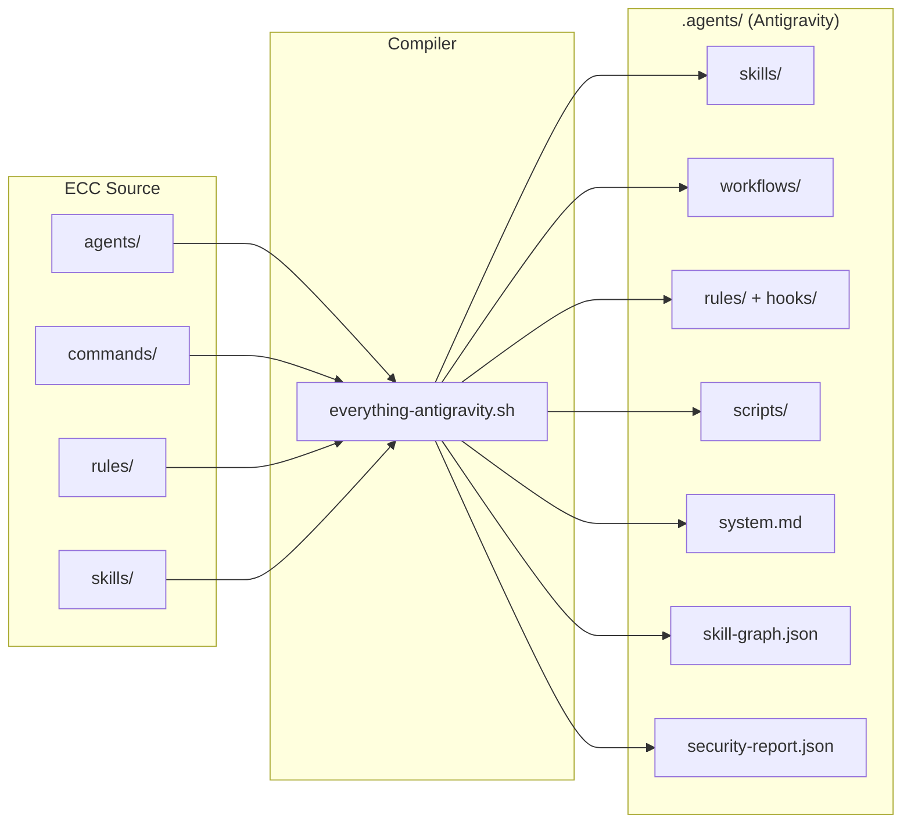

# ECC → Antigravity — Implementation Guide

> An agentic compiler that transforms the [Everything Claude Code](https://github.com/affaan-m/everything-claude-code) library into a fully autonomous development environment for the Google Antigravity IDE.

---

## Table of Contents

1. [Overview](#overview)
2. [Prerequisites](#prerequisites)
3. [Quick Start](#quick-start)
4. [Detailed Usage](#detailed-usage)
5. [Generated Architecture](#generated-architecture)
6. [The 7 Agentic Steps](#the-7-agentic-steps)
7. [Maintenance Tools](#maintenance-tools)
8. [Project Detection](#project-detection)
9. [Security (AgentShield)](#security-agentshield)
10. [Troubleshooting](#troubleshooting)
11. [Flag Reference](#flag-reference)

---

## Overview

The `everything-antigravity.sh` script is an **agentic compiler** that:

```
ECC (233 source files)  →  .agents/ (operational Antigravity environment)
```

It does more than copy files — it **analyzes**, **transforms**, and **enriches**:

| Phase | What happens |
|---|---|
| **Mapping** | Transposes agents → skills, commands → workflows, rules → rules (flattened) |
| **Configuration** | Generates each skill's configuration (descriptions, categories) |
| **Optimization** | Compresses system prompts, scores quality, segments content |
| **Security** | Scans for secrets, audits permissions, grades posture (A→F) |
| **Intelligence** | Generates hooks, dependency graph, agent identity |
| **Tooling** | Deploys 5 maintenance scripts |

---

## Prerequisites

### System

| Tool | Min. version | Check |
|---|---|---|
| `bash` | 4.0+ | `bash --version` |
| `python3` | 3.6+ | `python3 --version` |
| `git` | 2.0+ (optional, for source SHA detection) | `git --version` |

### Source Files

```bash
# Clone the ECC library
git clone https://github.com/affaan-m/everything-claude-code.git

# Verify expected structure
ls everything-claude-code/
# agents/  commands/  rules/  skills/  docs/  ...
```

> **Important**: The ECC directory must contain at minimum `agents/`, `commands/`, `rules/`, and `skills/`.

---

## Quick Start

### Step 1 — Prepare the environment

```bash
# Navigate to your working directory
cd /path/to/your/project

# Ensure the script is executable
chmod +x everything-antigravity.sh
```

### Step 2 — Run the full install

```bash
bash everything-antigravity.sh ./everything-claude-code
```

### Step 3 — Verify the result

```bash
# Generated structure
ls -la .agents/

# Health dashboard
.agents/scripts/ea-doctor
```

### Expected output

```
==================================
✅ ECC → Antigravity conversion complete
==================================

  .agents/
  ├── system.md           (agent identity)
  ├── skills/             (49 agents + 182 skills)
  ├── workflows/          (68 commands)
  ├── rules/              (85 rules, flattened)
  │   └── hooks/          (7 lifecycle hooks)
  ├── scripts/            (5 runtime tools)
  ├── skill-graph.json    (dependency graph)
  ├── security-report.json
  └── ea-install-state.json
```

---

## Detailed Usage

### Default mode (full install)

```bash
bash everything-antigravity.sh <ecc-path>
```

Performs a complete, idempotent installation:
- If a previous installation exists, it is cleaned up first (only files tracked in `ea-install-state.json` are removed)
- All objectives and steps are executed sequentially

### Verbose mode

```bash
bash everything-antigravity.sh ./everything-claude-code --verbose
```

Displays each copied file, each mapping decision, and scoring details.

### Optimization mode

```bash
bash everything-antigravity.sh ./everything-claude-code --optimize
```

Enables the prompt optimization pass:
- System instruction compression
- Quality scoring across 10 criteria
- Intelligent `system.md` segmentation
- Token budget report

### Flag combinations

```bash
# Full install, optimized, with stack detection
bash everything-antigravity.sh ./everything-claude-code --optimize --project . --verbose
```

---

## Generated Architecture

```
.agents/
├── system.md                    # Agent identity + skills catalog
├── skills/                      # 234 skills total
│   ├── <agent-slug>/            # e.g. code-reviewer/
│   │   └── SKILL.md             # Agent definition (generated from agent.md)
│   ├── <ea-skill-slug>/         # e.g. python-patterns/
│   │   └── SKILL.md             # Skill instructions
├── workflows/                   # 68 workflows (slash commands)
│   ├── plan.md
│   ├── code-review.md
│   └── ...
├── rules/                       # 85 rules (hierarchical flattening, no zh*)
│   ├── coding-standards.md
│   ├── hooks/                   # 7 behavioral hooks
│   │   ├── bash-safety.md
│   │   ├── gateguard.md
│   │   ├── quality-gate.md
│   │   ├── config-protection.md
│   │   ├── design-quality.md
│   │   ├── session-context.md
│   │   └── strategic-compaction.md
│   └── ...
├── scripts/                     # 5 maintenance tools
│   ├── ea-doctor               # Health diagnostic
│   ├── ea-list                 # List installed components
│   ├── ea-status               # Installation dashboard
│   ├── ea-logger               # Agent activity logger
│   └── ea-uninstall            # Clean uninstall
├── logs/                        # Activity traces (ea-logger)
├── skill-graph.json             # Dependency graph (234 nodes, 492 edges)
├── logging-config.json          # Agent logging configuration
├── security-report.json         # AgentShield security report
└── ea-install-state.json       # Install state (SHA, counters, files)
```

### Source → destination mapping

| ECC source | `.agents/` destination | Transformation |
|---|---|---|
| `agents/*.md` | `skills/<slug>/SKILL.md` | Conversion + cleanup |
| `commands/*.md` | `workflows/<name>.md` | Direct copy |
| `rules/**/*.md` | `rules/<flat-name>.md` | Flattening (no zh*) |
| `skills/*/SKILL.md` | `skills/<slug>/SKILL.md` | Direct copy |

---

## The 7 Agentic Steps

The compiler implements 7 steps that transform a collection of static files into a coherent agentic system:

### Step 1 — Hooks / Lifecycle (`rules/hooks/`)

Transposes ECC JavaScript hooks into **behavioral rules** that the agent consults natively.

| Hook | File | Impact |
|---|---|---|
| `bash-safety` | `bash-safety.md` | Blocks 8 destructive patterns |
| `gateguard` | `gateguard.md` | +2.25 quality points (measured) |
| `quality-gate` | `quality-gate.md` | 5 post-edit verifications |
| `config-protection` | `config-protection.md` | 10 protected files |
| `design-quality` | `design-quality.md` | UI anti-patterns |
| `session-context` | `session-context.md` | Auto context loading |
| `strategic-compaction` | `strategic-compaction.md` | Logical compaction |

### Step 2 — Dependency graph (`skill-graph.json`)

Automatic analysis of inter-skill relationships:

```json
{
  "_meta": {
    "total_skills": 234,
    "total_edges": 492,
    "with_dependencies": 54,
    "isolated": 77
  }
}
```

Detected relationship types:
- **`depends_on`**: skill A requires skill B
- **`enhances`**: skill A improves skill B
- **`related_to`**: thematic association

### Step 3 — Agent identity (`system.md`)

Dynamic system prompt that aggregates:
- Agent identity and role
- Categorized catalog of 234 skills
- Security posture (AgentShield grade)
- Active rules and hooks

### Step 4 — Project detection (`--project`)

Automatic tech stack analysis; detected technologies are recorded in `system.md` for informational use:

```bash
# Detect the stack and record it in system.md
bash everything-antigravity.sh ./everything-claude-code --project /path/to/my/app
```

15+ indicators detected: Python, Node.js, TypeScript, Go, Rust, Java, Kotlin, Swift, PHP, Ruby, C++, Flutter, Docker, Terraform, K8s.

### Step 5 — Runtime tools (`scripts/`)

5 standalone bash scripts for daily maintenance (see [dedicated section](#maintenance-tools)).

### Step 6 — State tracking

The full install is idempotent: a reinstall automatically cleans up and regenerates all files tracked in `ea-install-state.json`.

---

## Maintenance Tools

The 5 scripts generated in `.agents/scripts/` are standalone and only depend on `bash` and `python3`.

### `ea-doctor` — Health diagnostic

```bash
.agents/scripts/ea-doctor
```

Checks:
- ✅ Directory structure (`skills/`, `workflows/`, `rules/`)
- ✅ Presence of `system.md`, `skill-graph.json`, `security-report.json`
- ✅ `ea-install-state.json` integrity
- ✅ Counter consistency vs actual files
- ⚠️ Reports orphaned or missing files

### `ea-list` — Component inventory

```bash
.agents/scripts/ea-list              # List everything
.agents/scripts/ea-list skills       # Skills only
.agents/scripts/ea-list workflows    # Workflows only
.agents/scripts/ea-list rules        # Rules only
.agents/scripts/ea-list hooks        # Hooks only
```

### `ea-status` — Installation dashboard

```bash
.agents/scripts/ea-status
```

Displays:
- Installer version
- Installation date
- Detailed counters (agents, skills, workflows, rules)
- Source commit SHA (if available)

### `ea-logger` — Agent activity tracing

```bash
.agents/scripts/ea-logger tail            # Live stream
.agents/scripts/ea-logger view 50         # Last 50 entries
.agents/scripts/ea-logger stats           # Today's statistics
.agents/scripts/ea-logger level [level]   # Get or set level (silent/info)
.agents/scripts/ea-logger clear           # Archive and clear
```

### `ea-uninstall` — Clean uninstall

```bash
.agents/scripts/ea-uninstall
```

Removes only files tracked in `ea-install-state.json`, leaving the `.agents/` structure intact if other tools use it.

---

## Project Detection

The `--project <path>` flag analyzes your codebase and **installs the `.agents/` folder directly into the target project** (automatic behavior).

### Usage

```bash
# Installs .agents/ into ./ai-press-review/ AND detects Symfony stack
bash everything-antigravity.sh ./everything-claude-code --project ./ai-press-review

# Explicit equivalent with --output
bash everything-antigravity.sh ./everything-claude-code \
  --project ./ai-press-review \
  --output ./ai-press-review/.agents

# Force a custom destination (overrides automatic behavior)
bash everything-antigravity.sh ./everything-claude-code \
  --project ./my-app \
  --output /opt/agent-config
```

> **Output directory resolution rule**:
> 1. `--output <path>` → absolute priority, exact destination
> 2. `--project <path>` alone → destination = `<path>/.agents/`
> 3. Neither → destination = `.agents/` (current directory)

### Detected indicators

| Stack | Watched files |
|---|---|
| Python | `pyproject.toml`, `requirements.txt`, `Pipfile`, `*.py` |
| Node.js | `package.json`, `node_modules/` |
| TypeScript | `tsconfig.json`, `*.ts` |
| Go | `go.mod`, `go.sum` |
| Rust | `Cargo.toml` |
| Java | `pom.xml`, `build.gradle` |
| Kotlin | `*.kt`, `build.gradle.kts` |
| Swift | `Package.swift`, `*.xcodeproj` |
| PHP/Laravel | `composer.json`, `artisan` |
| Ruby | `Gemfile` |
| C++ | `CMakeLists.txt`, `Makefile` |
| Flutter/Dart | `pubspec.yaml` |
| Docker | `Dockerfile`, `docker-compose.yml` |
| Terraform | `*.tf` |
| Kubernetes | `k8s/`, `helmfile.yaml` |

### Result

The detected stack is recorded in `system.md` for informational purposes (no skills are disabled).

---

## Security (AgentShield)

The built-in security scanner automatically analyzes all generated files.

### What is scanned

| Category | Detected patterns |
|---|---|
| **Secrets** | API keys, tokens, hardcoded passwords (14 regex patterns) |
| **Permissions** | `bash` access without sandboxing guidance |
| **Injection** | Unquoted variables in bash workflows |
| **Configuration** | Sensitive files without explicit protection |

### Security grade

| Grade | Meaning |
|---|---|
| **A** | No critical or high findings |
| **B** | Medium findings only |
| **C** | 1–3 high findings |
| **D** | 4+ high findings |
| **F** | Critical findings (exposed secrets) |

### Report

```bash
# View the report
cat .agents/security-report.json | python3 -m json.tool

# Or via the doctor
.agents/scripts/ea-doctor
```

### CI Gate

In CI mode, the script returns exit code 2 if **critical** findings are detected, blocking the pipeline.

---

## Troubleshooting

### Script fails with "ECC directory not found"

```bash
# Verify the path is correct
ls ./everything-claude-code/agents/
# Should list .md files
```

### Agent cannot find skills

```bash
# Verify system.md was generated
head -20 .agents/system.md

# Check skills
ls .agents/skills/ | wc -l
# Should display ~234
```

### Permission issue

```bash
# Make scripts executable
chmod +x .agents/scripts/*
```

### Full diagnostic

```bash
# Run the doctor
.agents/scripts/ea-doctor

# If needed, clean reinstall
.agents/scripts/ea-uninstall
bash everything-antigravity.sh ./everything-claude-code
```

---

## Flag Reference

| Flag | Description | Example |
|---|---|---|
| `--optimize` | Enable prompt compression and scoring | `bash everything-antigravity.sh ./everything-claude-code --optimize` |
| `--verbose` | Show details of each operation | `bash everything-antigravity.sh ./everything-claude-code --verbose` |
| `--project <path>` | Stack detection + auto destination | `bash everything-antigravity.sh ./everything-claude-code --project ./my-app` |
| `--output <path>` | Explicit output directory (override) | `bash everything-antigravity.sh ./everything-claude-code --output /opt/agent` |

### Recommended combinations

```bash
# First install
bash everything-antigravity.sh ./everything-claude-code --verbose

# Install into a specific project (Symfony detection + auto destination)
bash everything-antigravity.sh ./everything-claude-code --project ./my-symfony-app

# Production install with optimization
bash everything-antigravity.sh ./everything-claude-code --optimize --project ./my-app

# Debug a problem
bash everything-antigravity.sh ./everything-claude-code --verbose 2>&1 | tee install.log

# Custom destination
bash everything-antigravity.sh ./everything-claude-code --output /opt/shared-agent
```

---

## Architecture Summary



---

## License

This script is an integration tool for using the Everything Claude Code library within the Google Antigravity environment. It respects the licenses of the source projects.
